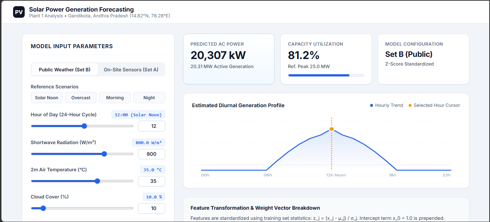

# AML Assignment 1 — Predicting Solar Power Plant Output from Weather

This repository contains the complete implementation for **Applied Machine Learning Assignment 1: Solar Power Plant Output Prediction**.

All modeling is implemented **strictly from scratch** using `numpy` and `pandas` only (no `scikit-learn`, `statsmodels`, or `scipy.stats`).

---

## 📁 Project Structure

```
AML Assign-1/
├── data/                               # Prepared & merged CSV datasets
│   ├── Plant_1_Generation_Data.csv      # Raw generation data
│   ├── Plant_1_Weather_Sensor_Data.csv # Raw sensor data
│   ├── plant1_hourly.csv               # Aggregated & resampled hourly dataset
│   ├── plant1_openmeteo.csv            # Public weather API data
│   └── plant1_merged.csv               # Merged feature dataset (Set A & Set B)
├── src/                                # Core python modules
│   ├── load_data.py                    # Raw CSV loader (from Appendix)
│   ├── prepare.py                      # Task 1: Data preprocessing & hourly resampling
│   ├── eda.py                          # Task 2: Four exploratory data analysis plots
│   ├── fetch_weather.py                # Task 3: Open-Meteo API fetcher & location verification
│   ├── regression.py                   # Task 4: Linear regression math from scratch
│   └── train_eval.py                   # Task 4: Model training, evaluation & hyperparameter tuning
├── results/                            # Figures, model weights, and analysis
│   ├── analysis.md                     # Task 5: Comprehensive analysis report
│   ├── blog_post.md                    # Medium Blog Post draft
│   ├── fig1_ac_vs_irradiation.png      # Plot 1: AC power vs Irradiation
│   ├── fig2_module_vs_ambient.png      # Plot 2: Module vs Ambient Temp
│   ├── fig3_ac_vs_dc.png               # Plot 3: AC vs DC power ratio
│   ├── fig4_avg_power_by_hour.png      # Plot 4: Average power by hour of day
│   ├── fig5_weather_verification.png   # Plot 5: On-site vs Open-Meteo verification
│   ├── fig6_learning_rate_batch_gd.png # Plot 6: Batch GD learning rate curves
│   ├── fig7_learning_rate_sgd.png      # Plot 7: SGD learning rate curves
│   ├── fig8_residuals_by_hour.png      # Plot 8: Residual analysis vs hour of day
│   ├── fig9_actual_vs_predicted.png    # Plot 9: Actual vs Predicted power
│   ├── fig11_project_poster.png        # Final Project Presentation Poster
│   ├── linkedin_post.md                # LinkedIn announcement post
│   ├── model_weights.json              # Exported weights & scaling stats for web app
│   ├── project_poster.md               # Poster content and layout document
│   └── regression_results.csv          # Complete model performance summary table
├── app/                                # Task 6: Web Application
│   ├── index.html                      # Professional interactive web interface
│   └── server.py                       # Local HTTP server script
└── README.md                           # Project documentation
```

---

## 🚀 How to Run

### Step 1: Prepare Data & Aggregate to Hourly Means (Task 1)
```bash
python src/prepare.py
```
*Creates `data/plant1_hourly.csv` (796 hourly rows).*

### Step 2: Generate Exploratory Data Analysis Plots (Task 2)
```bash
python src/eda.py
```
*Generates figures 1–4 in `results/`.*

### Step 3: Fetch Open-Meteo Weather Data & Verify Location (Task 3)
```bash
python src/fetch_weather.py
```
*Fetches historical weather data for Lat 14.82, Lon 78.28, verifies 0.933 correlation with sensor data, and saves `data/plant1_merged.csv`.*

### Step 4: Train Models & Evaluate Solvers (Task 4)
```bash
python src/train_eval.py
```
*Trains 6 models (Set A & B x 3 Solvers), computes test RMSE, checks convergence, and exports `results/model_weights.json`.*

### Step 5: Review Analysis (Task 5)

Read [`results/analysis.md`](results/analysis.md) for the required data-preparation table, RMSE comparison, learned-weight table, learning-rate analysis, solver discussion, and residual interpretation.

### Step 6: Launch Web App Interface (Task 6)
```bash
python app/server.py
```
Open your browser at **`http://localhost:8000`** to interact with the web app!



---

## 📊 Summary Results Table

| Feature Set | Solver | Train RMSE (kW) | Test RMSE (All 168h) | Test RMSE (Daytime) |
|---|---|---|---|---|
| **Set A (Sensors)** | **Normal Equation** | **537.62** | **539.46** | **704.46** |
| **Set A (Sensors)** | **Batch GD** ($\alpha=10^{-3}$) | **741.84** | **880.25** | **1,144.76** |
| **Set A (Sensors)** | **SGD** ($\alpha=0.01$) | **539.93** | **549.47** | **714.47** |
| **Set B (Public)** | **Normal Equation** | **2,699.92** | **2,620.94** | **3,409.50** |
| **Set B (Public)** | **Batch GD** ($\alpha=0.1$) | **2,699.92** | **2,620.94** | **3,409.50** |
| **Set B (Public)** | **SGD** ($\alpha=0.01$) | **2,744.92** | **2,699.92** | **3,453.25** |

---

## 💡 Key Findings & Physics Insights
1. **On-Site Sensors (Set A) achieve ~2.35% error** relative to peak plant capacity (~30 MW), compared to **~11.36% error for public weather data (Set B)**.
2. **Module Temperature is Critical**: Panel efficiency drops as module temperature rises ($\theta_{\text{module\_temp}} \approx -108$).
3. **Solver Comparison**: With $\alpha=10^{-3}$ and 10,000 iterations, Batch GD is stable but has not fully converged to the Normal Equation solution; a smaller learning rate requires more iterations to reach the same optimum.

---

## 📢 Publications & Presentation
- **[Medium Blog Post](results/blog_post.md)**: A comprehensive data science walkthrough of our journey, predicting solar power output.
- **[Project Poster](results/fig11_project_poster.png)**: A professional, print-ready academic poster summarizing our research, data pipeline, models, and conclusions.
- **[LinkedIn Post](results/linkedin_post.md)**: A structured announcement for professional networks, sharing our findings and providing a link to this repository.
